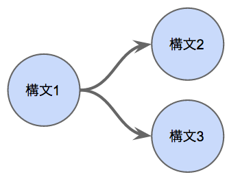
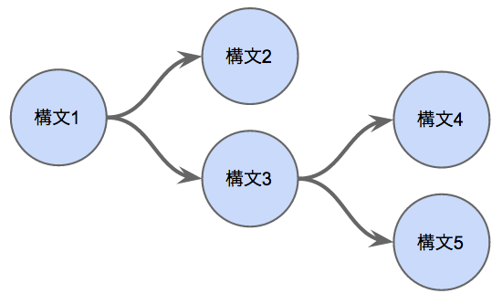

# サンプルクエリ概要

下記5つのクエリファイルの概要を記載する。

* query0.q
* query1.q
* query2.q
* query3.q
* query4.q

これらのクエリファイルは、段階的に処理を追加しステップアップしていく。

## 第0段階: 基本クエリ

サンプルの基本となる最初のクエリ。

1. データを取得する
2. 入力データを全てMongoDBに出力する

```
FROM demo USING kafka_spout()
EMIT * USING mongo_persist('demo', 'output0')
;
```

## 第1段階: ステータス毎のカウントを集計

ステータス(status)には閲覧(watch)/予約(commit)/キャンセル(cancel)の3つのステータスがあるので、ステータス毎のカウントを集計させる。

Webサービス全体での閲覧/予約/キャンセル数を出力させる。

1. データを取得する
2. ステータス毎に処理を分ける
3. カウントを集計する
4. ステータスとカウントをMongoDBに出力する

```
FROM demo USING kafka_spout()
BEGIN GROUP BY status
  EACH status, count() AS count
END GROUP
EMIT status, count USING mongo_persist('demo', 'output1', ['status'])
;
```

処理項目「3. カウントを集計する」の **EACH** 句では、集計関数 **count()** を使うと共に、MongoDBへの出力時に **status** フィールドも出力したい為、指定している。

出力先の **output1** コレクションでは、 **status** フィールドの値を元にアップデート対象のドキュメントを絞り込む。

## 第2段階: ホテル・ステータス毎の集計

第1段階のクエリを更にホテル毎に集計するように処理を追加する。また、第1段階のクエリと同様にステータス毎のみの集計処理も行う。

ホテル毎の閲覧/予約/キャンセル数を出力する。

1. データを取得する
2. ステータス毎、ホテル・ステータス毎の処理に分岐
3. ステータス毎の集計
 1. ステータス毎に処理を分ける
 2. カウントを集計する
 3. ステータスとカウントをMongoDBに出力する
4. ホテル・ステータス毎の集計
 1. ホテル毎に処理を分ける
 2. ステータス毎に処理を分ける
 3. カウントを集計する
 4. ホテルID、ステータス、カウントをMongoDBに出力する

※ 処理項目「3. ステータス毎の集計」は第1段階のクエリと同じ処理を行っている(出力先コレクションを変更しているのみ)。

```
FROM demo USING kafka_spout()
INTO s1
;
FROM s1
BEGIN GROUP BY status
  EACH status, count() as count
END GROUP
EMIT status, count USING mongo_persist('demo', 'output2_1', ['status'])
;
FROM s1
BEGIN GROUP BY hotelId
  BEGIN GROUP BY status
    EACH hotelId, status, count() AS count
  END GROUP
  EMIT hotelId, status, count USING mongo_persist('demo', 'output2_2', ['hotelId', 'status'])
END GROUP
;
```

処理を分岐させる為、3つの構文に分割している。

* 構文1: データの取得
* 構文2: ステータス毎の集計を行い出力
* 構文3: ホテル・ステータス毎の集計を行い出力

これらの構文は、それぞれ下図のように接続している。



処理項目「4.1. ホテル毎に集計を分ける」と処理項目「4.2. ステータス毎に処理を分ける」は、1つの **GROUP BY** 句で表現することも可能である(下記参照)。

```
FROM s1
BEGIN GROUP BY hotelId, status
  EACH hotelId, sttus, count() AS count
END GROUP
EMIT hotelId, status, count USING mongo_persist('demo', 'output2_2', ['hotelId', 'status'])
;
```

## 第3段階: マスタデータと結合し出力データを装飾

ホテル名称やエリアコードを持つマスタデータと結合し、出力するデータに理解しやすいホテル名称を追加する。

1. データを取得する
2. ステータス毎、ホテル・ステータス毎の処理に分岐
3. ステータス毎の集計
 1. ステータス毎に処理を分ける
 2. カウントを集計する
 3. ステータスとカウントをMongoDBに出力する
4. ホテル・ステータス毎の集計
 1. マスタデータと結合する
 2. ホテル毎に処理を分ける
 3. ステータス毎に処理を分ける
 4. カウントを集計する
 5. 全フィールドデータをMongoDBに出力する

処理項目「4.1. マスタデータと結合する」を追加した以外は第2段階のクエリとほぼ同様である(出力先コレクションの変更と、出力フィールドを絞らずに全てのフィールドを出力するようにしている)。

```
FROM demo USING kafka_spout()
INTO s1
;
FROM s1
BEGIN GROUP BY status
  EACH status, count() as count
END GROUP
EMIT status, count USING mongo_persist('demo', 'output3_1', ['status'])
;
FROM s1
JOIN hotel
  ON hotel.hotelId = hotelId
  TO hotel.hotelName AS hotelName, hotel.areaCd AS areaCd
  EXPIRE 1h
  USING mongo_fetch('demo', 'hotel')
BEGIN GROUP BY hotelId
  BEGIN GROUP BY status
    EACH *, count() AS count
  END GROUP
  EMIT * USING mongo_persist('demo', 'output3_2', ['hotelId', 'status'])
END GROUP
;
```

**JOIN** 句を用いて、MongoDBにあるマスタデータ( **hotel** コレクション)と、 **hotelId** フィールドの値を元に結合をしている。 **Tuple** にはマスタデータに存在する **hotelName** (ホテル名称)および **areaCd** (地域コード)を追加する。

マスタデータの変更は滅多にないと考えられるため、一度MongoDBに問い合わせたデータは1時間キャッシュしておく。

## 第4段階: 出力先にKafkaを追加

集計結果をMongoDBへの出力(保存)だけでなく、Kafkaを用いて適切な相手へ通知を行う。

1. データを取得する
2. ステータス毎、ホテル・ステータス毎の処理に分岐
3. ステータス毎の集計
 1. ステータス毎に処理を分ける
 2. カウントを集計する
 3. ステータスとカウントをMongoDBに出力する
4. ホテル・ステータス毎の集計
 1. マスタデータと結合する
 2. ホテル毎に処理を分ける
 3. ステータス毎に処理を分ける
 4. カウントを集計する
 5. 処理を分岐
 6. 全フィールドデータをMongoDBに出力する
 7. 全フィールドデータをKafkaに通知する

```
FROM demo USING kafka_spout()
INTO s1
;
FROM s1
BEGIN GROUP BY status
  EACH status, count() as count
END GROUP
EMIT status, count USING mongo_persist('demo', 'output4_1', ['status'])
;
FROM s1
JOIN hotel
  ON hotel.hotelId = hotelId
  TO hotel.hotelName AS hotelName, hotel.areaCd AS areaCd
  USING mongo_fetch('demo', 'hotel')
BEGIN GROUP BY hotelId
  BEGIN GROUP BY stat
    EACH *, count() AS count
  END GROUP
  INTO s2
END GROUP
;
FROM s2
EMIT * USING mongo_persist('demo', 'output4_2', ['hotelId', 'status'])
;
FROM s2
EMIT * USING kafka_emit('demo4')
;
```

上記のクエリは下記5つの構文から構成される。

* 構文1: データの取得
* 構文2: ステータス毎の集計を行い出力
* 構文3: ホテル・ステータス毎の集計
* 構文4: 集計結果をMongoDBに出力
* 構文5: 集計結果をKafkaに通知

これらの構文は、それぞれ下図のように接続している。



Kafkaへの通知は、 **demo** トピックに全集計結果を通知しているが、トピックを分ける事でホテル毎に通知を行うといった対応が考えられる。

### [補足]Kafkaの確認方法

Kafkaに同梱の`kafka-console-consumer.sh`を用いてKafkaに通知される内容を確認する。

```
$ cd ${KAFKA_INSTALL_DIR}
$ ./bin/kafka-console-consumer.sh --topic demo --zookeeper localhost:2181
```
